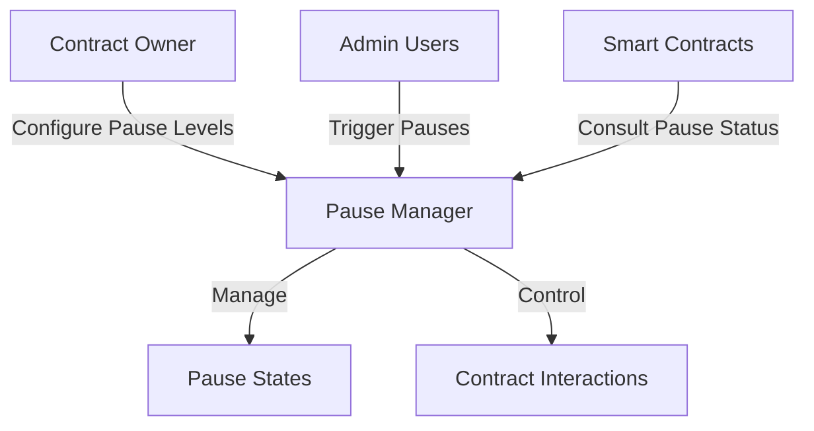

# Swift Pause Controller

A flexible, decentralized pausability mechanism for smart contract management on the Stacks blockchain.

## Overview

Swift Pause Controller provides a robust framework for implementing granular pause states across smart contracts, enhancing security, risk management, and emergency response capabilities.

## Key Features

- Multi-level pause states
- Granular contract interaction control
- Decentralized governance
- Emergency halt mechanisms
- Flexible authorization

## Architecture



### Pause Levels

1. **Global Pause**: Halt all contract interactions
2. **Partial Pause**: Disable specific functions
3. **Emergency Mode**: Freeze critical operations

## Getting Started

### Prerequisites

- Clarinet
- Stacks wallet
- Basic understanding of smart contract pausability

### Installation

1. Clone the repository
2. Install dependencies
3. Deploy the contract

### Usage Examples

#### Set Pause State
```clarity
(set-pause-state 
    pause-level 
    affected-functions 
    reason)
```

#### Check Pause Status
```clarity
(is-paused function-name)
```

## Security Considerations

- Only authorized administrators can modify pause states
- Pause mechanisms have built-in governance controls
- Transparent logging of all pause-related actions

## Development

### Testing
```bash
clarinet test
```

### Local Development
```bash
clarinet console
```

## Contributions

We welcome contributions! Please see our contribution guidelines for details.

## License

[Specify License]